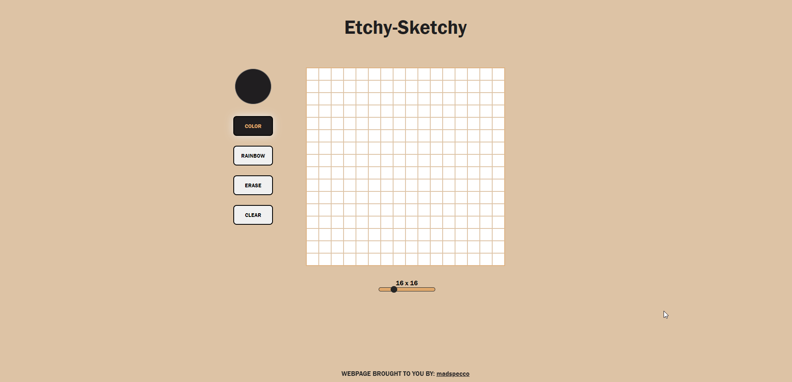

# Etch-a-Sketch

## Links
* [Try The Website here!](https://madspecco.github.io/etchy-sketchy/)
* [Link to Assignment](https://github.com/madspecco/etchy-sketchy)

# About
This webiste allows the user to sketch using different colors. \
It also comes with features like:
- Rainbow Mode
- Erase Mode
- Clear
- Resizeable Grid

In ordder to create this website I have used certain JS techniques such as:
- Injecting code from JS into HTML
- Having multiple event listeners
- Updating HTML live as the user inputs the desired grid size as well as the color picker

# Overview
